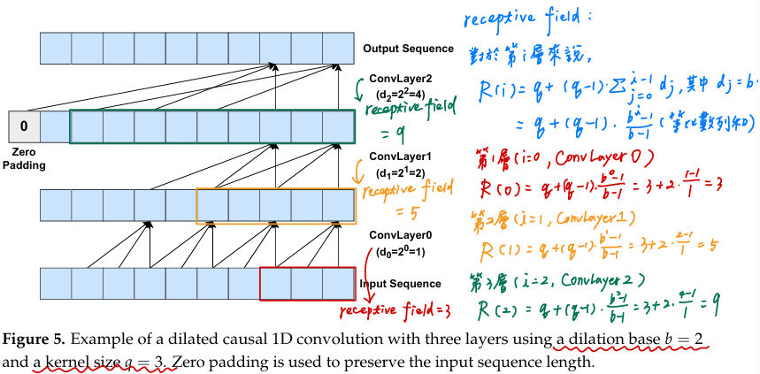

# Temporal Convolutional Networks

## tcn.py
- Reference: [PyTorch-TCN](https://github.com/paul-krug/pytorch-tcn)

### 說明擴張卷積層數(Dilated convolutions layers, $g$)的公式推導

#### 擴張卷積 和 擴張因子(dilation factor, $d$) 和
擴張卷積（dilated convolution）是一種在卷積操作中引入空隙（間隔）的技術，擴張因子 ( $d$ ) 決定了卷積核在輸入信號上滑動時，每一步的間隔。當 ( $d = 1$ ) 時，擴張卷積退化為普通的一維卷積。當 ( $d > 1$ ) 時，卷積核在輸入信號上跳過了 ( $d-1$ ) 個元素，這樣可以擴展卷積核的接受域（receptive field）

#### 卷積層數 ( $g$ ) 的公式
公式 $g = \left\lceil \log_b \left( \frac{(n-1)(b-1)}{q-1} + 1 \right) \right\rceil$  描述了需要的卷積層數 ( $g$ ) ，以確保卷積操作能夠覆蓋整個輸入序列的長度

- $n$：輸入序列的長度
- $q$：卷積核的大小
- $b$：擴張基數（dilation base），每一層的擴張因子 $d_i$ 由 $b$ 的次方決定，即 $d_i = b^i$

#### 推導過程

1. **接受域的概念**：
   - 接受域（receptive field）是指卷積層在輸入信號上能夠「看到」的範圍，當使用擴張卷積時，接受域會隨著擴張因子的增加而擴大
   - 對於第 $i$ 層，接受域大小為 $q + (q-1) \cdot \sum_{j=0}^{i-1} d_j$，其中 $d_j = b^j, i \geq 1$

2. **接受域的計算**：
   - 當我們有 $g$ 層卷積時，接受域大小可以表示為：
     $R(g) = q + (q-1) \cdot \sum_{j=0}^{g-1} b^j$
   - 求和項 $\sum_{j=0}^{g-1} b^j$ 是一個等比數列，可以用公式計算：
     $\sum_{j=0}^{g-1} b^j = \frac{1*(b^g - 1)}{b - 1}$
   - 將其代入接受域公式：
     $R(g) = q + (q-1) \cdot \frac{b^g - 1}{b - 1}$
   - 使用公式計算，如下圖:
     

3. **確保接受域覆蓋整個輸入序列**：
   - 我們希望接受域覆蓋整個輸入序列，即 $R(g) \geq n$：
     $q + (q-1) \cdot \frac{b^g - 1}{b - 1} \geq n$
   - 化簡得：
     $(q-1) \cdot \frac{b^g - 1}{b - 1} \geq n - q$
     $b^g - 1 \geq \frac{(n-q)(b-1)}{q-1}$
     $b^g \geq \frac{(n-q)(b-1)}{q-1} + 1$

4. **取對數並解出 $g$**：
   - 兩邊取對數：
     $g \geq \log_b \left( \frac{(n-q)(b-1)}{q-1} + 1 \right)$
   - 為了保證 $g$ 是整數，取上限：
     $g = \left\lceil \log_b \left( \frac{(n-1)(b-1)}{q-1} + 1 \right) \right\rceil$

即為公式的推導過程，確保我們使用 $g$ 層擴張卷積層可以有效地覆蓋整個輸入序列

